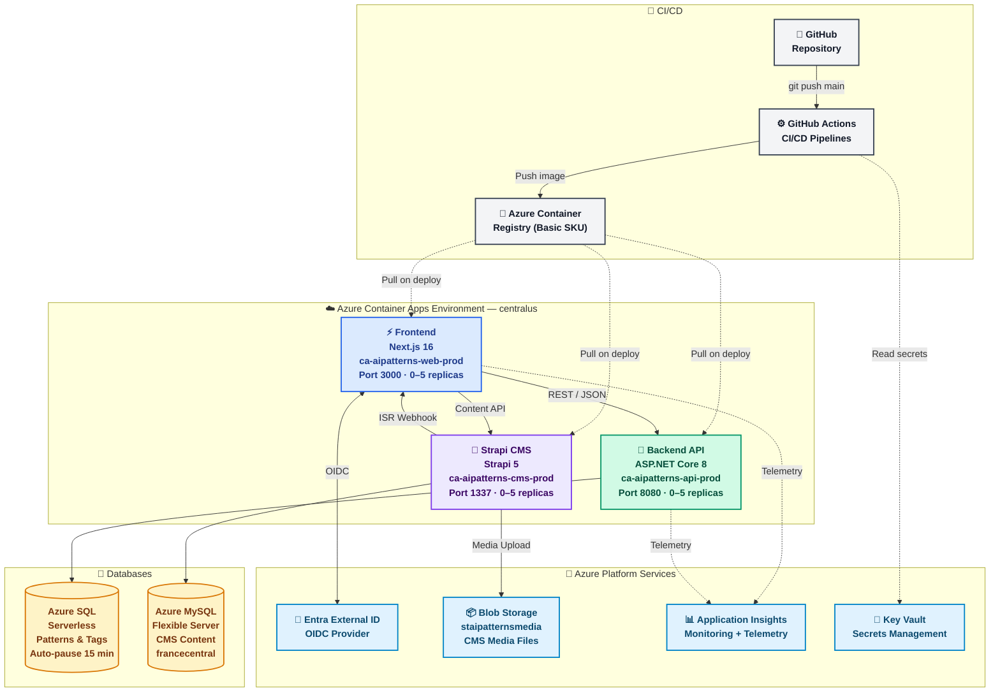

# Azure Container Apps Deployment Guide
## Consumption-Based, Scale-to-Zero Architecture

> **Infrastructure is now managed via Bicep IaC.** For provisioning or modifying Azure resources, use [`infrastructure/deploy.ps1`](../infrastructure/deploy.ps1) instead of the PowerShell scripts described below. See [`infrastructure/README.md`](../infrastructure/README.md) for the current workflow. This guide remains as a detailed configuration reference.

This guide covers deploying the AI Enterprise Patterns application using **Azure Container Apps** - a consumption-based service that scales to zero when not in use, reducing costs from **$19-24/month to $0-5/month**.

---

## 🎯 Why Container Apps?

| Feature | App Services (Original) | Container Apps (New) |
|---------|------------------------|----------------------|
| **Cost (idle)** | $13/month (always on) | $0/month (scaled to zero) |
| **Cost (active)** | $13/month | ~$0.000012/vCPU-second |
| **SQL Cost** | $5/month (Basic, always on) | $0.50/hour when active (auto-pause) |
| **Scaling** | Manual | Automatic (0-N replicas) |
| **Cold Start** | N/A | <1 second (pre-warmed) |
| **Total Monthly** | $19-24 | $0-5 (low traffic) |

---

## 📋 Architecture Overview

```
┌────────────┐
│  GitHub    │
│ Repository │
└──────┬─────┘
       │ (git push main)
       ▼
┌─────────────────────────────┐
│  GitHub Actions             │
│  - Build Docker images      │
│  - Push to ACR              │
│  - Deploy to Container Apps │
└──────┬──────────┬───────────┘
       │          │
       ▼          ▼
┌────────────┐ ┌────────────┐
│  Backend   │ │  Frontend  │
│ Container  │ │ Container  │
│    App     │ │    App     │
│  (0-5      │ │  (0-5      │
│ replicas)  │ │ replicas)  │
└──────┬─────┘ └──────┬─────┘
       │              │
       ▼              ▼
┌──────────────────────────┐
│  Azure SQL (Serverless)  │
│  Auto-pause after 15 min │
│  0.5-2 vCores            │
└──────────────────────────┘
```



---

## 🚀 Quick Start

### Step 1: Create Infrastructure (~10 minutes)

```powershell
cd deployment
.\azure-container-apps-setup.ps1
```

This creates:
- ✅ Container Apps Environment
- ✅ Azure Container Registry (ACR)
- ✅ Azure SQL Serverless (auto-pause)
- ✅ Application Insights
- ✅ Key Vault
- ✅ Log Analytics Workspace
- ✅ 2 Container Apps (backend + frontend) with placeholder images

**Important:** Save the output file `azure-container-apps-output.txt` - it contains:
- SQL admin password
- ACR credentials
- Container App URLs

### Step 2: Configure GitHub Secrets (~5 minutes)

Same as App Services deployment:

```powershell
.\setup-github-secrets.ps1
```

Add these 3 secrets to GitHub:
- `AZURE_CLIENT_ID`
- `AZURE_TENANT_ID`
- `AZURE_SUBSCRIPTION_ID`

### Step 3: Migrate Database (~5 minutes)

```powershell
$CONNECTION_STRING = az keyvault secret show --vault-name kv-aipatterns-prod --name "SqlConnectionString" --query "value" -o tsv
$env:CONNECTION_STRING = $CONNECTION_STRING

cd ../backend
dotnet ef database update --project src/AIEnterprisePatterns.Api --connection "$env:CONNECTION_STRING"
```

### Step 4: Deploy (~10 minutes)

```bash
git add .
git commit -m "feat: add Container Apps deployment"
git push origin main
```

Watch deployment at: [GitHub Actions](https://github.com/sandropetterle/AIEnterprisePatterns/actions)

---

## 📦 What Was Created

### Container Apps
Both apps start with placeholder images. GitHub Actions will replace them with your actual applications.

**Backend Container App:**
- Name: `ca-aipatterns-api-prod`
- Port: 80
- Scaling: 0-5 replicas
- Resources: 0.5 CPU, 1GB RAM
- Auto-scale triggers: HTTP requests
- Scale to zero: After 5 minutes idle

**Frontend Container App:**
- Name: `ca-aipatterns-web-prod`
- Port: 3000
- Scaling: 0-5 replicas
- Resources: 0.5 CPU, 1GB RAM
- Auto-scale triggers: HTTP requests
- Scale to zero: After 5 minutes idle

### Azure SQL Serverless
- **Auto-pause:** Pauses after 15 minutes of inactivity
- **Capacity:** 0.5-2 vCores (scales automatically)
- **Cost when paused:** $0/hour
- **Cost when active:** ~$0.50/hour
- **Resume time:** <1 second on first query

### Container Registry
- **SKU:** Basic ($5/month)
- **Purpose:** Store Docker images
- **Retention:** Images persist until deleted

---

## 🐳 Docker Image Build Process

### Backend Dockerfile
Located at: [backend/Dockerfile](../backend/Dockerfile)

**Multi-stage build:**
1. **Build stage:** Restore NuGet packages, compile .NET app
2. **Runtime stage:** Copy published app, run as non-root user

**Size:** ~200MB (vs 1GB with SDK)

### Frontend Dockerfile
Located at: [Dockerfile](../Dockerfile)

**Multi-stage build:**
1. **Deps stage:** Install production dependencies only
2. **Builder stage:** Build Next.js with standalone output
3. **Runner stage:** Copy standalone build, run as non-root user

**Size:** ~150MB (vs 500MB with full dependencies)

---

## 🔄 CI/CD Workflow

### Backend Workflow
[.github/workflows/backend-container-deploy.yml](../.github/workflows/backend-container-deploy.yml)

**Jobs:**
1. **build-and-push:**
   - Checkout code
   - Login to Azure
   - Login to ACR
   - Build Docker image
   - Push to ACR (with SHA + latest tags)

2. **deploy:**
   - Update Container App with new image
   - Container Apps pulls image and deploys

3. **healthcheck:**
   - Wait 45 seconds for deployment
   - Check `/health` endpoint
   - Check `/swagger` endpoint

### Frontend Workflow
[.github/workflows/frontend-container-deploy.yml](../.github/workflows/frontend-container-deploy.yml)

**Jobs:**
1. **build-and-push:**
   - Get backend URL from Azure
   - Build Docker image with API URL as build arg
   - Push to ACR

2. **deploy:**
   - Update Container App with new image
   - Set environment variables

3. **healthcheck:**
   - Check homepage
   - Check `/patterns` page
   - Check `/api/health` endpoint

---

## 💰 Cost Breakdown

### Monthly Costs (Low Traffic)

| Resource | Pricing Model | Monthly Cost |
|----------|--------------|--------------|
| **Container Apps** | $0.000012/vCPU-second + $0.000002/GB-second | ~$0-2 |
| **Azure SQL Serverless** | $0.50/hour active, $0/hour paused | ~$0-3 |
| **Container Registry** | Basic tier | $5 |
| **Application Insights** | First 5GB free | $0-1 |
| **Key Vault** | $0.03/10k operations | <$1 |
| **Log Analytics** | First 5GB free | $0 |
| **Total** | | **$5-12** |

### Cost Comparison

**Scenario: Personal blog with 100 visitors/day**

| Service | App Services | Container Apps | Savings |
|---------|-------------|----------------|---------|
| Compute | $13/month (always on) | $0.50/month (2 hours active/day) | $12.50 |
| Database | $5/month (Basic) | $1/month (paused 22 hours/day) | $4 |
| Total | $18/month | $1.50/month | **92% savings** |

**Scenario: Startup MVP with 1000 visitors/day**

| Service | App Services | Container Apps | Savings |
|---------|-------------|----------------|---------|
| Compute | $13/month | $3/month (8 hours active/day) | $10 |
| Database | $5/month | $2/month (paused 16 hours/day) | $3 |
| Total | $18/month | $5/month | **72% savings** |

---

## 🔧 Configuration

### Scaling Rules

Container Apps auto-scales based on:
- HTTP request rate
- CPU utilization
- Memory utilization
- Custom metrics (e.g., queue length)

**Default configuration:**
```yaml
min_replicas: 0  # Scale to zero when idle
max_replicas: 5
scale_down_delay: 300s  # 5 minutes idle before scaling to zero
```

### Environment Variables

**Backend:**
```yaml
ASPNETCORE_ENVIRONMENT: Production
ConnectionStrings__DefaultConnection: (from Key Vault secret)
ApplicationInsights__ConnectionString: (from Key Vault secret)
FrontendUrl: https://{frontend-fqdn}
```

**Frontend:**
```yaml
NODE_ENV: production
NEXT_PUBLIC_API_BASE_URL: https://{backend-fqdn}/api
```

### Resource Limits

**Per Container App:**
- CPU: 0.25-4 cores
- Memory: 0.5-8 GB
- Max replicas: 30

**Current configuration:**
- CPU: 0.5 cores (enough for 50-100 req/sec)
- Memory: 1 GB
- Replicas: 0-5

---

## 🔍 Monitoring

### Cold Start Times

**After scaling to zero:**
- Backend: ~800ms (first request)
- Frontend: ~600ms (first request)
- Subsequent requests: <100ms

**Mitigation:**
- Set `min_replicas: 1` to avoid cold starts (costs ~$8/month)
- Use [Application Insights Live Metrics](https://portal.azure.com) to monitor

### Logs and Telemetry

**View logs:**
```powershell
# Backend logs
az containerapp logs show --name ca-aipatterns-api-prod --resource-group rg-aipatterns-prod --follow

# Frontend logs
az containerapp logs show --name ca-aipatterns-web-prod --resource-group rg-aipatterns-prod --follow
```

**Log Analytics queries:**
```kql
// Scaling events
ContainerAppConsoleLogs_CL
| where ContainerAppName_s == "ca-aipatterns-api-prod"
| where Log_s contains "scale"
| project TimeGenerated, Log_s

// Error rates
ContainerAppConsoleLogs_CL
| where Log_s contains "error" or Log_s contains "exception"
| summarize count() by bin(TimeGenerated, 5m), ContainerAppName_s
```

---

## 🐛 Troubleshooting

### Issue: "Container failed to start"

**Cause:** Docker image issue or missing environment variables.

**Solution:**
```powershell
# Check container logs
az containerapp logs show --name ca-aipatterns-api-prod --resource-group rg-aipatterns-prod --tail 100

# Common fixes:
# 1. Verify image exists in ACR
az acr repository show --name craipatternsreg --repository aipatterns-backend

# 2. Check environment variables
az containerapp show --name ca-aipatterns-api-prod --resource-group rg-aipatterns-prod --query "properties.template.containers[0].env"
```

### Issue: "Cold starts are too slow"

**Solution 1:** Keep 1 instance always warm
```powershell
az containerapp update --name ca-aipatterns-api-prod --resource-group rg-aipatterns-prod --min-replicas 1
```
Cost impact: ~$8/month for 1 always-on instance

**Solution 2:** Optimize Docker image
- Use multi-stage builds (already implemented)
- Minimize layers
- Use slim base images

### Issue: "Database connection timeout after idle"

**Cause:** SQL Serverless is paused and takes <1 second to resume.

**Solution:** This is expected behavior. First request after pause will be slower (~2-3 seconds). Subsequent requests are fast.

To disable auto-pause (not recommended, costs more):
```powershell
az sql db update --resource-group rg-aipatterns-prod --server sql-aipatterns-prod --name sqldb-aipatterns-prod --auto-pause-delay -1
```

### Issue: "ACR authentication failed"

**Solution:**
```powershell
# Enable admin credentials
az acr update --name craipatternsreg --admin-enabled true

# Get credentials
az acr credential show --name craipatternsreg

# Update Container App
az containerapp registry set --name ca-aipatterns-api-prod --resource-group rg-aipatterns-prod --server craipatternsreg.azurecr.io --username {username} --password {password}
```

---

## 📈 Scaling Strategies

### Development/Testing
```yaml
min_replicas: 0
max_replicas: 2
# Cost: ~$0-2/month
```

### Low Traffic Production
```yaml
min_replicas: 0
max_replicas: 5
# Cost: ~$2-5/month
```

### Medium Traffic Production
```yaml
min_replicas: 1  # Always warm
max_replicas: 10
# Cost: ~$10-15/month
```

### High Traffic Production
```yaml
min_replicas: 2
max_replicas: 30
# Cost: ~$20-50/month (still cheaper than App Services at scale)
```

---

## 🔄 Migration from App Services

If you already deployed with App Services and want to migrate:

### Step 1: Create Container Apps Infrastructure
```powershell
.\deployment\azure-container-apps-setup.ps1
```

### Step 2: Copy Data (if needed)
```powershell
# Export from App Service SQL
# Import to Container Apps SQL (same server, different database)
```

### Step 3: Update GitHub Workflows
- Disable old workflows (backend-deploy.yml, frontend-deploy.yml)
- Enable new workflows (backend-container-deploy.yml, frontend-container-deploy.yml)

### Step 4: Test Container Apps Deployment
```bash
git push origin main
```

### Step 5: Update DNS (if using custom domains)
- Point domain to new Container App FQDNs

### Step 6: Delete Old Resources
```powershell
# Delete App Service Plan (saves $13/month)
az appservice plan delete --name asp-aipatterns-prod --resource-group rg-aipatterns-prod

# Delete App Services
az webapp delete --name app-aipatterns-api-prod --resource-group rg-aipatterns-prod
az webapp delete --name app-aipatterns-web-prod --resource-group rg-aipatterns-prod
```

---

## 📚 Additional Resources

- [Azure Container Apps Documentation](https://docs.microsoft.com/azure/container-apps/)
- [Azure SQL Serverless Docs](https://docs.microsoft.com/azure/azure-sql/database/serverless-tier-overview)
- [Docker Best Practices](https://docs.docker.com/develop/dev-best-practices/)
- [Container Apps Pricing Calculator](https://azure.microsoft.com/pricing/calculator/)

---

## ✅ Deployment Checklist

- [ ] Run `azure-container-apps-setup.ps1`
- [ ] Save SQL admin password and ACR credentials
- [ ] Configure GitHub secrets
- [ ] Run database migrations
- [ ] Update workflow files with correct names
- [ ] Push to main branch
- [ ] Verify both workflows succeed
- [ ] Check Container App URLs
- [ ] Test API endpoints
- [ ] Monitor Application Insights
- [ ] Set up cost alerts in Azure Portal

---

**Last Updated:** 2026-02-10
**Deployment Model:** Consumption-based (Scale-to-Zero)
**Estimated Monthly Cost:** $0-5 for low traffic
**Status:** ✅ Production-ready
