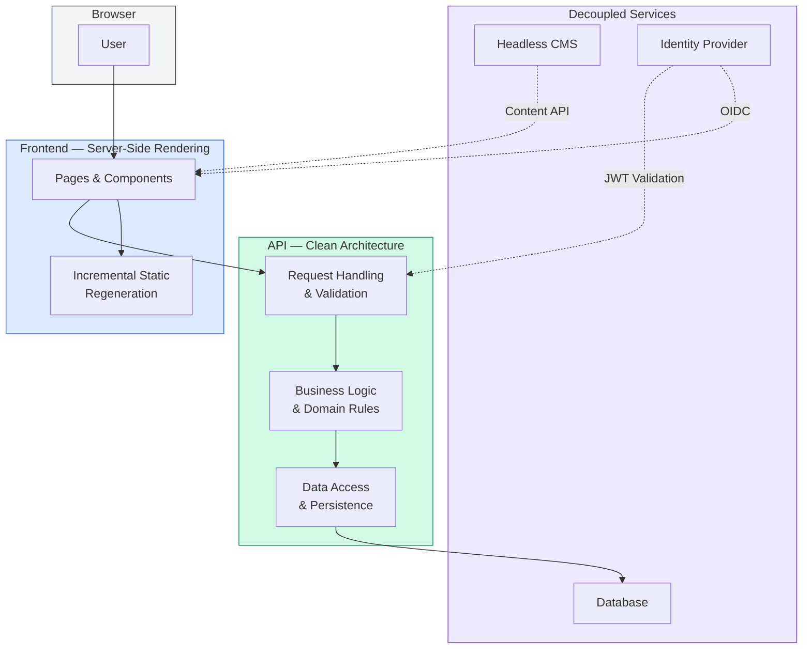
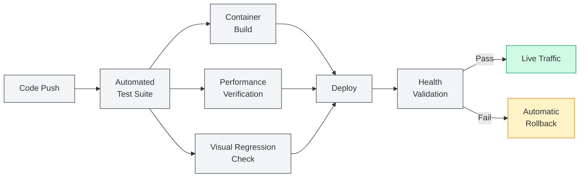

# AI Enterprise Patterns Library — Executive Summary

**Date:** 2026-03-21 | **Version:** Post-Phase 7 (Quality & Hardening Complete)
**Audience:** CTOs, VPs of Engineering, Technical Leadership

---

## Solution Overview

The AI Enterprise Patterns Library is a production-ready, full-stack knowledge platform for curating and sharing enterprise architectural patterns for AI-driven systems. It combines a modern web frontend with a robust API backend, a headless content management system, and cloud-native infrastructure — all deployed on Azure.

What distinguishes this solution is not the technology stack itself, but the engineering discipline applied across every layer: a layered architecture that isolates business logic from infrastructure concerns, automated quality gates that prevent defective code from reaching production, defense-in-depth security that doesn't depend on any single control, declarative infrastructure that eliminates configuration drift, and governed documentation that preserves institutional knowledge across team changes.

---

## Layered Architecture

The system follows Clean Architecture principles with a strict dependency direction — outer layers depend on inner layers, never the reverse. This means business rules live at the centre of the system, insulated from changes to databases, hosting platforms, or third-party services.

**Why this matters:**

- **Swap without rewriting.** Business logic is isolated from infrastructure. Changing databases, cloud providers, or identity systems requires configuration changes — not code rewrites.
- **Performance and SEO by default.** Server-side rendering reduces the JavaScript shipped to browsers. Pages load faster and are indexable by search engines without additional effort.
- **Content independence.** A headless CMS decouples content management from application code. Editors can update text, imagery, and page layouts without developer involvement or redeployment.
- **No vendor lock-in on identity.** Authentication uses an industry-standard protocol. Switching identity providers — from one cloud vendor to another, or to a self-hosted solution — requires only configuration changes.

> Deep dive: [System Architecture Overview](architecture/SYSTEM_OVERVIEW.md) | [Backend Architecture](architecture/BACKEND_ARCHITECTURE.md) | [Frontend Architecture](architecture/FRONTEND_ARCHITECTURE.md)

---

## Multi-Layer Quality Assurance

Quality is enforced through six complementary testing layers, each targeting a different category of defect. Every layer runs automatically and acts as a deployment gate — no code reaches production without passing all of them.

| Layer | What Risk It Mitigates |
|-------|----------------------|
| **Component-level tests** | Catch regressions in business logic and UI behaviour before code is merged |
| **Cross-browser end-to-end tests** | Verify real user flows work identically across browser engines, catching platform-specific bugs that unit tests miss |
| **Performance budgets** | Enforce load time and interactivity thresholds, preventing gradual performance degradation as features are added |
| **Visual regression detection** | Flag unintended UI changes across dozens of component states before they reach users |
| **Accessibility compliance** | Ensure the application meets WCAG standards, reducing legal risk and expanding the potential user base |
| **Coverage thresholds** | Enforce a minimum testable coverage floor in CI, preventing gradual erosion of test quality over time |

**Why this matters:** Quality is systemic, not dependent on individual discipline. The pipeline enforces the same standard on every change, regardless of urgency, team size, or who is deploying. A coverage threshold that cannot be bypassed means the safety net never shrinks — it only grows.

> Deep dive: [Testing Strategy](testing/TESTING_STRATEGY.md)

---

## Security by Design

Security follows a defense-in-depth approach — multiple independent layers so that no single failure compromises the system.

- **Input boundaries** — All external input is validated and sanitised at entry points, preventing injection attacks and cross-site scripting. Content from the CMS is sanitised separately, protecting against compromised content sources.
- **Rate limiting** — Tiered request throttling protects against abuse and ensures fair resource allocation. Write-heavy endpoints have stricter limits than read operations.
- **Authentication and authorisation** — Role-based access control with encrypted sessions. The identity provider is decoupled from the application — switching providers requires no code changes, eliminating vendor lock-in for a critical security component.
- **Transport and headers** — Strict transport security, content security policies, and frame protection headers reduce the browser-side attack surface. These are enforced on both the frontend and API independently.
- **Supply chain integrity** — All third-party dependencies — CI pipeline actions, container base images, and application packages — are pinned to immutable references. Automated monitoring detects newly disclosed vulnerabilities across all dependency ecosystems.
- **Container hardening** — Minimal base images with non-root execution reduce the attack surface to the bare minimum. No package managers or shell utilities are present in production images.
- **Secrets management** — All credentials are stored in a managed vault with identity-based access. No plaintext secrets exist in code, configuration files, or deployment scripts.

**Why this matters:** Security is structural, not bolted on after the fact. Each layer operates independently, so a weakness in one does not cascade. Every accepted risk is documented with its rationale, giving security reviewers a complete picture rather than a blank slate to audit.

> Deep dive: [Security Overview](architecture/SECURITY_OVERVIEW.md)

---

## Infrastructure as Code

All infrastructure is defined declaratively in version-controlled templates. Nothing is configured manually through a cloud portal — every resource, its configuration, and its relationships are codified and reviewable.

- **Reproducible environments** — Any environment can be recreated from templates alone. There is no hidden state, no portal-only settings, and no "it works because someone configured it once."
- **Change preview** — Infrastructure changes are previewed before applying, showing exactly what will be created, modified, or removed. This eliminates deployment surprises.
- **Governance at the template level** — Resource tagging, naming conventions, and parameter validation are enforced in the templates themselves, not in a wiki or verbal agreement.
- **Cost-proportional scaling** — The architecture uses scale-to-zero compute and serverless databases. Costs are proportional to actual usage, not provisioned capacity. A development environment costs near-zero when idle; the same architecture scales to production workloads without redesign.

**Why this matters:** Infrastructure drift — where live environments silently diverge from their intended state — is one of the most common sources of production incidents and security gaps. Declarative IaC eliminates this category of risk entirely.

> Deep dive: [Infrastructure Management](operations/INFRASTRUCTURE_MANAGEMENT.md)

---

## Automated Deployment Pipeline

Every deployment passes through automated quality gates that no individual can bypass. The pipeline is the single path to production.

- **Consistent standards** — The pipeline enforces the same quality bar on every change, regardless of urgency or who is deploying. There is no "fast track" that skips validation.
- **Automatic rollback** — If health checks fail after deployment, the previous known-good version is restored automatically. Failed deployments do not require manual intervention or on-call escalation.
- **Queued deployments** — Concurrent deployments are prevented. Each deployment completes (or rolls back) before the next begins, eliminating race conditions.
- **Least-privilege access** — Each pipeline stage has only the permissions it needs. A compromised build step cannot modify production infrastructure or access secrets outside its scope.

**Why this matters:** Deployment risk is the leading cause of production incidents in most organisations. An automated, gated pipeline with automatic rollback transforms deployment from a high-risk event into a routine operation.

> Deep dive: [Quality Gates & Hardening](architecture/QUALITY_HARDENING.md)

---

## Operational Readiness

Production systems are instrumented for self-healing, observability, and structured incident response — not just "it runs."

- **Self-healing infrastructure** — Health probes continuously monitor container health. Unhealthy instances are automatically restarted before users experience degradation.
- **Business-level telemetry** — The system tracks user engagement (content views, votes, searches), not just infrastructure metrics. This enables data-driven product decisions alongside operational monitoring.
- **Proactive alerting** — Metric-based alerts trigger notifications for error rate spikes, slow response times, and availability drops — catching issues before they escalate into incidents.
- **Documented response procedures** — Runbooks, incident response playbooks, disaster recovery procedures, and monitoring guides are maintained alongside the code. The operations team inherits a system they can run confidently — not just a system that happens to be running.

**Why this matters:** Operational readiness is the difference between a system that works and a system that can be maintained. Documented procedures, automated health management, and business telemetry mean the team spends time on improvement, not firefighting.

> Deep dive: [Monitoring Guide](operations/MONITORING_GUIDE.md) | [Operational Runbook](operations/RUNBOOK.md) | [Disaster Recovery](operations/DISASTER_RECOVERY.md)

---

## Governed Documentation

Documentation follows explicit governance rules — not "write docs when you remember."

- **Architectural decision records** — Every significant decision is recorded with its rationale and the alternatives that were considered. New team members understand *why* the system is built the way it is, without relying on tribal knowledge or reverse-engineering intent from code.
- **Single source of truth** — Each topic has exactly one authoritative document. Cross-references link related topics without duplicating content, eliminating the "which doc is current?" problem.
- **Stakeholder reading paths** — Different roles (architect, DevOps, security, product) have guided paths through the documentation, so they find what they need without wading through irrelevant detail.
- **Visual diagrams** — Architecture flows, data models, authentication sequences, and deployment pipelines are documented as embedded diagrams that render alongside their explanations — not in a separate drawing tool that falls out of sync.
- **Lifecycle policies** — Stale documentation is archived rather than left to mislead. Retention rules prevent accumulation of outdated snapshots while preserving audit history.

**Why this matters:** Documentation is the primary vehicle for scaling a team. When every decision is recorded, every process is documented, and every diagram is current, onboarding is faster, handoffs are cleaner, and institutional knowledge survives team changes.

> Deep dive: [Documentation Governance](GOVERNANCE.md) | [Documentation Index](../DOCUMENTATION_INDEX.md) | [Technical Decisions Log](decisions/TECHNICAL_DECISIONS_LOG.md)

---

## Developer Experience and Discoverability

The solution includes three reference libraries that make the system self-documenting for developers — reducing onboarding friction and eliminating guesswork when integrating with the API, CMS, or UI components.

- **API reference library** — Every endpoint is documented with its method, path, authentication requirements, rate limit tier, request/response shapes, and example payloads. Developers integrating with the backend have a single, authoritative reference rather than reading controller code or experimenting with requests. A development-only interactive explorer is available for hands-on testing without affecting production.
- **CMS component library** — The headless CMS uses a structured content model with reusable components organised by namespace. Every component's fields, types, constraints, and dependencies are documented in a central index with a visual dependency map — making it clear how content blocks compose into pages and where shared components are reused.
- **Interactive UI component catalog** — A living Storybook catalog renders every UI component in isolation across its supported states — default, loading, error, empty, dark mode. This serves as both a visual reference for designers and a development sandbox for engineers. Visual regression detection runs against this catalog automatically, catching unintended changes before they reach production.

**Why this matters:** Self-documenting systems reduce the cost of change. When developers can discover API contracts, content schemas, and UI component behaviour without reading source code or asking colleagues, feature velocity increases and integration errors decrease.

> Deep dive: [API Reference](api/) | [CMS Component Index](cms-components/COMPONENT_INDEX.md) | [CMS Architecture](architecture/CMS_ARCHITECTURE.md)

---

## Roadmap and Extensibility

The solution is production-ready today. The Clean Architecture foundation means future capabilities extend the system without requiring architectural changes.

| Phase | Focus | Status |
|-------|-------|--------|
| Infrastructure Drift Resolution | Align live Azure resources with IaC templates; apply pending security hardening | Complete |
| Community Features | User collaboration, content export, notifications, performance optimisation | Future |
| Enterprise Features | Internationalisation, analytics dashboards, multi-tenancy, AI-powered search | Future |

Each phase is planned, scoped, and documented before implementation begins. This deliberate, phased approach ensures that growth is sustainable and each investment builds on a stable foundation.

> Deep dive: [Project Roadmap](project/ROADMAP.md)

---

## Further Reading

**For Architects:**
- [System Architecture Overview](architecture/SYSTEM_OVERVIEW.md) — full system design and component relationships
- [Technical Decisions Log](decisions/TECHNICAL_DECISIONS_LOG.md) — all architectural decisions with rationale and alternatives
- [CMS Architecture](architecture/CMS_ARCHITECTURE.md) — headless CMS design, content model, and deployment

**For Security:**
- [Security Overview](architecture/SECURITY_OVERVIEW.md) — authentication, authorisation, headers, and threat model
- [Infrastructure Management](operations/INFRASTRUCTURE_MANAGEMENT.md) — IaC reference, Bicep drift resolution, and security hardening (Phase 7.11)

**For DevOps and SRE:**
- [Infrastructure Management](operations/INFRASTRUCTURE_MANAGEMENT.md) — IaC reference and deployment procedures
- [Operational Runbook](operations/RUNBOOK.md) — day-to-day operational procedures

**For Frontend and Integration Developers:**
- [API Reference](api/) — endpoint documentation, DTOs, and examples
- [CMS Component Index](cms-components/COMPONENT_INDEX.md) — content model, field schemas, and dependency map

**For Product and Engineering Management:**
- [Project Roadmap](project/ROADMAP.md) — phase status and future plans
- [Functional Requirements](requirements/FUNCTIONAL_REQUIREMENTS.md) — feature scope and user journeys
