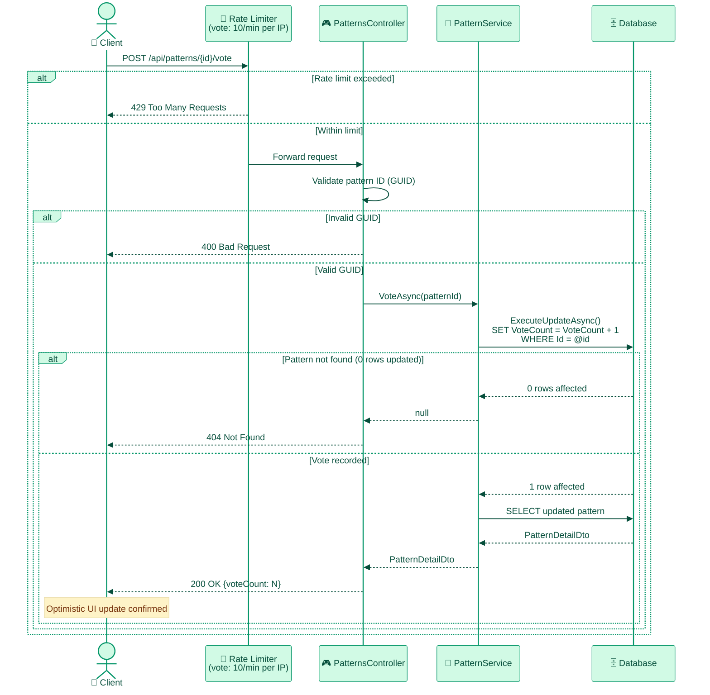
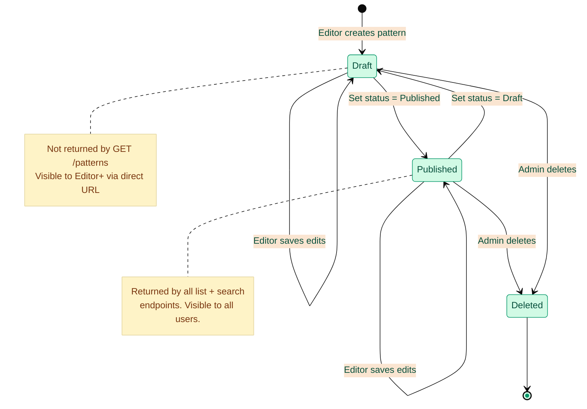

# Backend Architecture

**Last Updated:** 2026-02-27
**Audience:** Backend Developers, Solutions Architects
**Purpose:** Describe the ASP.NET Core 8 backend structure, Clean Architecture layers, patterns used, and the full API reference.

---

## 1. Clean Architecture Layers

```
AIEnterprisePatterns.Api          ← HTTP layer: Controllers, DTOs, Middleware, Validators, Filters
        ↓ depends on
AIEnterprisePatterns.Core         ← Domain layer: Entities, Services, Interfaces, Enums, Value Objects
        ↓ depends on
AIEnterprisePatterns.Data         ← Persistence layer: Repositories, DbContext, Migrations
        (Infrastructure)          ← Empty placeholder for future services
```

**Dependency rule:** Outer layers depend on inner layers. `Api` → `Core` → `Data`. No reverse dependencies.


---

## 2. Key Patterns & Components

### Repository Pattern
- Interface defined in `Core`: `IPatternRepository`
- Implementation in `Data`: `PatternRepository`
- `GetRelatedPatternsAsync(slug, limit=3)` — category-first + tag-overlap + vote-sorted, `AsNoTracking`

### Unit of Work
- `IUnitOfWork` registered as scoped service in DI
- `PatternService` calls `repository.SaveAsync()` directly (UoW not actively used — the interface is registered but bypassed)

### PatternMapper
- Dedicated mapper class (not AutoMapper) in `Core`
- `ToDto`: `Pattern` → `PatternListDto` (excludes `FullContent` for list queries)
- `ToDetailDto`: `Pattern` → `PatternDetailDto` (includes tags, full content)
- **Category mapping:** Backend enum `DesignPatterns` → frontend string `"Design Patterns"` (see [DATA_MODEL.md](DATA_MODEL.md))

### Value Objects
- `Slug`: immutable value object with `GeneratedRegex` validation (lowercase alphanumeric + hyphens)

### Memory Caching
- `IMemoryCache` for featured, trending, and related patterns
- Cache keys: `featured_patterns`, `trending_patterns`, `related_patterns_{slug}`
- TTL: 5 minutes, no explicit cache invalidation on vote

### Rate Limiting (Fixed Window)
| Policy | Limit | Window |
|--------|-------|--------|
| `fixed` | 100 req/min | Per IP |
| `api` | 50 req/min | Per IP |
| `vote` | 10 req/min | Per IP |

### TimeProvider
- `TimeProvider.System` injected via DI for testable time operations

---

## 3. API Reference

> Full API reference has moved to **[`documentation/api/`](../api/API_REFERENCE_INDEX.md)** — includes DTOs, validation rules, request/response examples, and query parameter details.

Quick links:
- [API Reference Index](../api/API_REFERENCE_INDEX.md) — base URLs, versioning, auth, rate limiting, error shapes
- [Patterns API](../api/PATTERNS_API.md) — all `/patterns` endpoints with full DTO tables and examples
- [Auth API](../api/AUTH_API.md) — `/auth/me`
- [Health API](../api/HEALTH_API.md) — `/health`, `/health/ready`

---

## 3a. Pattern Vote Flow



---

## 4. Data Validation

- `FluentValidation` applied to all DTOs: `CreatePatternDto`, `UpdatePatternDto`
- `GetPatternsQuery` validated with `Range` and `MaxLength` constraints
- Automatic model validation via `AddValidatorsFromAssembly` + validation filter
- `MaxLength` on all text input fields

---

## 5. Error Handling

- Global error handling middleware: returns consistent JSON error responses
- No exception details leaked to clients in production
- API returns standard problem detail objects (`ProblemDetails`)

---

## 6. Performance Optimizations

- **EF Core projections:** `Select()` excludes `FullContent` from list queries (only fetched on detail)
- **Atomic SQL updates:** `ExecuteUpdateAsync()` for vote operations to prevent race conditions
- **Memory caching:** Featured, trending, and related patterns cached for 5 minutes
- **Efficient indexing:** Database indexed on slug, category, and tags
- **Pagination:** All list endpoints paginate to limit data transfer
- **`AsNoTracking()`** on all read-only queries

---

## 6a. Pattern Lifecycle



---

## 7. Project Structure

```
backend/
├── src/
│   ├── AIEnterprisePatterns.Api/
│   │   ├── Controllers/
│   │   │   ├── PatternsController.cs
│   │   │   └── AuthController.cs
│   │   ├── DTOs/
│   │   ├── Middleware/
│   │   ├── Validators/
│   │   ├── Filters/
│   │   └── Program.cs
│   ├── AIEnterprisePatterns.Core/
│   │   ├── Entities/          ← Pattern, Tag
│   │   ├── Enums/             ← PatternCategory, PatternStatus
│   │   ├── Interfaces/        ← IPatternRepository, IPatternService, IUnitOfWork
│   │   ├── Services/          ← PatternService
│   │   ├── Mappers/           ← PatternMapper
│   │   └── ValueObjects/      ← Slug
│   └── AIEnterprisePatterns.Data/
│       ├── Repositories/      ← PatternRepository, UnitOfWork
│       ├── Migrations/
│       └── ApplicationDbContext.cs
└── tests/
    ├── AIEnterprisePatterns.Core.Tests/
    ├── AIEnterprisePatterns.Data.Tests/
    └── AIEnterprisePatterns.Api.Tests/   ← includes integration tests
```

---

## 7a. Backend Domain Model


---

## 8. Testing

- **Framework:** xUnit + Moq + FluentAssertions
- **Repository tests:** EF Core InMemory provider
- **Integration tests:** `WebApplicationFactory` with `TestAuthHandler` (header-driven auth via `X-Test-Roles`)
- **Current count:** 105 tests passing
- **Coverage:** ~85% on testable code

See [../testing/TESTING_STRATEGY.md](../testing/TESTING_STRATEGY.md) for full testing approach.

---

## 9. Configuration

```bash
# Backend environment variables
ConnectionStrings__DefaultConnection=   # Empty = SQLite dev; set for SQL Server
FrontendUrl=http://localhost:3000        # CORS allowed origin
Authentication__Authority=              # Entra OIDC authority (optional; auth disabled if not set)
Authentication__Audience=               # API app client ID
Authentication__RequireHttpsMetadata=true
```

See [../../deployment/github-secrets-setup.md](../../deployment/github-secrets-setup.md) for production secrets configuration.
