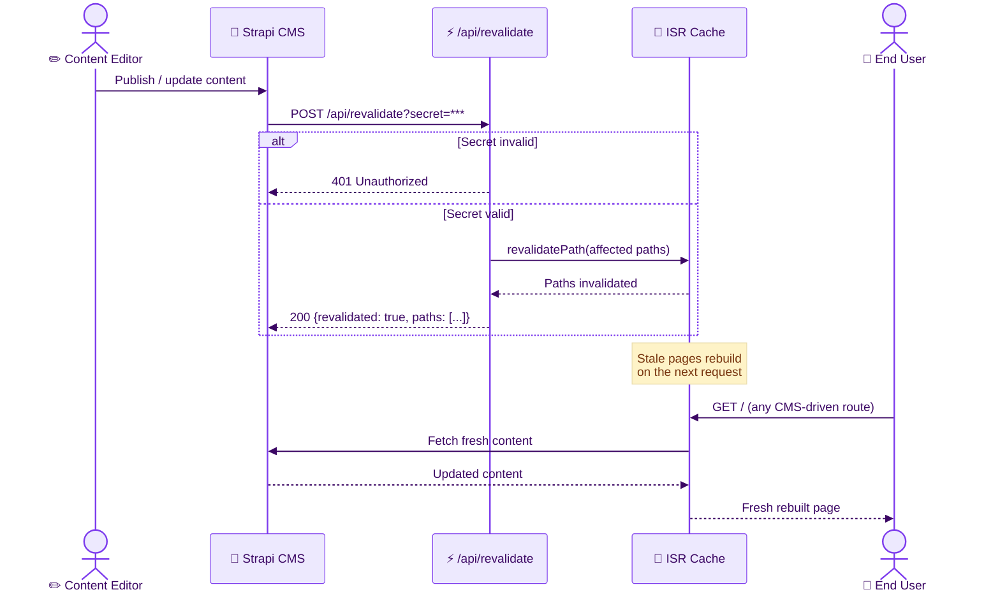

# CMS Architecture

**Last Updated:** 2026-02-27
**Audience:** Frontend Developers, Solutions Architects, Infrastructure Engineers
**Purpose:** Document the Strapi 5 CMS integration — content model, deployment, ISR revalidation webhook, and known operational gotchas.

---

## 1. Overview

Strapi 5 (headless CMS) manages all **static site content** — page copy, labels, navigation text, and marketing sections. Pattern data (the application's core domain entities) is stored in Azure SQL and managed via the API, not Strapi.

**CMS Phase Status:**
- ✅ Phase 1 (CMS.1–CMS.3): Infrastructure, home page Dynamic Zone, global layout, on-demand revalidation — complete and deployed to production
- 🔜 Phase 2 (6.4–6.6): About, Docs, Login, Error, Not-Found pages + pattern UI labels — upcoming

---

## 2. Content Model

Strapi content types and their purpose:

| Content Type | Purpose |
|-------------|---------|
| `home-page` | Home page content (Dynamic Zone: hero, featured patterns, stats) |
| `global-layout` | Shared navigation, footer, site-wide labels |
| `about-page` | About page Dynamic Zone (Phase 6.4) |
| `docs-page` | Documentation page Dynamic Zone (Phase 6.4) |
| `login-page` | Login page labels (Phase 6.4) |
| `error-page` | Error page content with fallback (Phase 6.4) |
| `not-found-page` | 404 page content (Phase 6.4) |
| `pattern-listing-labels` | Labels for SearchBar, FilterPanel, SortSelector, EmptyState, Pagination (Phase 6.5) |
| `pattern-detail-labels` | Labels for all pattern detail sub-components (Phase 6.5) |
| `pattern-form-labels` | Labels for PatternForm create/edit (Phase 6.5) |

**Dynamic Zones** allow page-specific component sections to be managed from the CMS without code changes.

For the full component schema reference (field tables, dependency map, reuse guide), see [documentation/cms-components/COMPONENT_INDEX.md](../cms-components/COMPONENT_INDEX.md).

---

## 3. Infrastructure

| Component | Value |
|-----------|-------|
| CMS Framework | Strapi 5 |
| CMS Database (Production) | Azure MySQL Flexible Server (`mysql-aipatterns-cms.mysql.database.azure.com`), francecentral region |
| CMS Database (Development) | SQLite (via Docker Compose) |
| Media Storage | Azure Blob Storage (`staipatternsmedia.blob.core.windows.net`, `strapi-media` container, public read) |
| Hosting | Azure Container App (`ca-aipatterns-cms-prod.mangotree-f65a3b02.centralus.azurecontainerapps.io`) |
| CMS Admin | https://ca-aipatterns-cms-prod.mangotree-f65a3b02.centralus.azurecontainerapps.io/admin |

**MySQL configuration:**
- SKU: `Standard_B1ms` (francecentral — `Standard_B1s` rejected at creation on this subscription)
- Storage: 20 GB (Azure minimum), auto-grow **disabled**, auto-IO scaling **disabled**
- Region: francecentral (centralus has no MySQL Flexible Server SKUs on this subscription)

---

## 4. Local Development

```bash
# Start Strapi + MySQL locally (requires --profile cms; they don't start by default)
docker compose --profile cms up -d

# Stop CMS containers when not in use
docker compose --profile cms down

# Access admin panel
http://localhost:1337/admin
# Credentials: admin@aipatterns.dev / Admin12345

# Seed content
STRAPI_API_TOKEN=<full-access-token> npx tsx cms/data/seed.ts
# Note: use full-access token for seeding (read-only token can't PUT); revoke after seeding
```

> **Note:** MySQL and Strapi are assigned the `cms` profile to avoid running them by default — they each consume ~512 MB RAM. Only start them when actively working on CMS content. SQLite is used for the backend API in development; SQL Server (`docker compose up -d`) is separate and only needed if testing against SQL Server locally.

---

## 5. Frontend CMS Client

**`lib/cms/client.ts`** — `fetchStrapi(path, options)`:
- Wraps `fetch()` with error handling
- Network errors (ECONNREFUSED, AggregateError) throw `CmsUnavailableError`
- Enables graceful fallback to hardcoded defaults when Strapi is unavailable

**`lib/cms/queries.ts`** — Content type query functions:
- `getHomePage()`, `getGlobalLayout()`, etc.
- Each uses `populate` parameters to include nested components

**`lib/cms/types.ts`** — TypeScript types for all Strapi responses

**`lib/cms/components.tsx`** — Dynamic Zone component renderers mapped by `__component` field

---

## 6. ISR Revalidation

On-demand revalidation ensures Next.js ISR cache is cleared when content changes in Strapi.

**Webhook:** Strapi fires a POST to `https://<frontend>/api/revalidate?secret=<REVALIDATE_SECRET>` on every entry event (create, update, delete, publish, unpublish).

**Route handler:** `app/api/revalidate/route.ts`
- Validates the `secret` query parameter
- Calls `revalidatePath()` for the affected page(s)
- Returns `{revalidated: true, paths: [...]}` on success
- Returns `{message: "Model not handled"}` for unknown content types

**Expected responses:**
| Scenario | Response |
|----------|---------|
| Wrong/missing secret | 401 |
| Valid secret + known model | 200 `{revalidated: true, paths: [...]}` |
| Valid secret + unknown model | 200 `{message: "Model not handled"}` |

**ISR revalidation times:**
| Route | Time-based TTL | On-demand |
|-------|---------------|-----------|
| Home (`/`) | 300s | ✅ |
| Global layout | 3600s | ✅ |
| Pattern listings | 120s | — |
| Pattern details | 600s | — |



---

## 7. Populate API Quirks

> ⚠️ **Known gotcha:** `populate[component]=*` fails with HTTP 400 if the component has a Media relation field (e.g., `seo.ogImage`). Use explicit field selection instead:

```
# ❌ Fails when component has media relation:
populate[seo]=*

# ✅ Use explicit field selection:
populate[seo][fields][0]=title&populate[seo][fields][1]=description
```

Wildcard `*` only works for scalar fields within a component.

---

## 8. Deployment Gotchas

These are hard-won lessons from the CMS deployment. Ignoring them will cause cryptic failures.

1. **`@strapi/provider-upload-azure-storage` does not exist on npm.** Use `strapi-provider-upload-azure-storage-v5` (v1.1.0).

2. **Production Dockerfile must include `tsconfig.json` + `config/` source files.** Strapi 5 needs both at runtime to resolve compiled config paths via `tsUtils.resolveOutDirSync`. Without them: crash with `Cannot destructure property 'client' of 'db.config.connection'`.

3. **Pre-create `/app/database/migrations` in Dockerfile** with non-root ownership. The `strapi` user can't `mkdir` at runtime.

4. **Azure Container Apps `:latest` tag can serve stale images.** Use explicit `@sha256:DIGEST` when deploying to force-pull the new image.

5. **ACR Tasks not available** on this subscription tier. Build locally and push: `docker buildx build --platform linux/amd64`.

6. **Use `npm install` not `npm ci`** in the Dockerfile (no lockfile in Strapi).

7. **`DATABASE_CLIENT` must be `mysql`** not `mysql2` (Strapi 5 dialect names changed).

8. **`tsconfig.json` must include `"./src/**/*.json"`** so JSON schema files are copied to `dist/`.

9. **`docker compose restart` doesn't pick up env var changes.** Use `docker compose up -d --force-recreate`.

10. **On-demand revalidation webhook local URL** uses `host.docker.internal:3000`, not `localhost:3000`.

---

## 9. Key Files

| File | Purpose |
|------|---------|
| `cms/` | Strapi 5 project root |
| `cms/data/seed.ts` | Seeds all hardcoded content into Strapi |
| `cms/Dockerfile` | Production container build |
| `deployment/scripts/provision-cms.ps1` | Provisions Azure MySQL + Container App + Blob Storage |
| `.github/workflows/cms-container-deploy.yml` | CI/CD workflow for CMS deployment |
| `lib/cms/client.ts` | Frontend CMS HTTP client |
| `lib/cms/queries.ts` | Content type query functions |

---

## 10. Related Decisions

See [../decisions/TECHNICAL_DECISIONS_LOG.md](../decisions/TECHNICAL_DECISIONS_LOG.md) Decisions 28–39 for the full CMS implementation history (provider choice, MySQL region constraints, storage sizing, image deployment, webhook setup).
