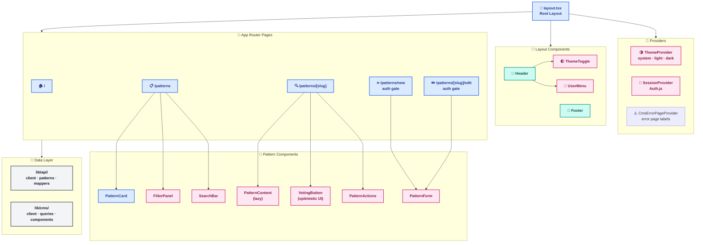

# Frontend Architecture

**Last Updated:** 2026-03-19
**Audience:** Frontend Developers, Solutions Architects
**Purpose:** Describe the Next.js 16 frontend structure, App Router conventions, authentication flow, CMS integration, ISR strategy, and coding standards.

---

## 1. Technology Stack

| Technology | Version | Purpose |
|-----------|---------|---------|
| Next.js | 16 | Framework (App Router, Server Components, ISR) |
| React | 19 | UI rendering |
| TypeScript | — | Type safety |
| Tailwind CSS | 3.4 | Utility-first styling |
| shadcn/ui | — | Accessible component primitives |
| Auth.js (NextAuth) | v5 | Authentication (OIDC) |
| react-markdown + rehype-sanitize | — | Safe markdown rendering |
| Sonner | — | Toast notifications |
| next/image | — | Optimized image loading |
| Lucide | — | Icon library |

---

## 2. Project Structure

```
app/                              ← Next.js App Router pages
├── page.tsx                      ← Home page (Server Component)
├── layout.tsx                    ← Root layout (ThemeProvider, SessionProvider, CmsErrorPageProvider, Header, Footer)
├── loading.tsx                   ← Global loading skeleton
├── error.tsx                     ← Global error boundary (Client Component; uses useCmsErrorPage() context)
├── not-found.tsx                 ← 404 page
├── patterns/
│   ├── page.tsx                  ← Patterns listing (Server Component)
│   ├── loading.tsx               ← Listing skeleton
│   ├── new/page.tsx              ← Create pattern (Server Component — auth gate)
│   └── [slug]/
│       ├── page.tsx              ← Pattern detail (Server Component)
│       └── edit/page.tsx         ← Edit pattern (Server Component — auth gate)
├── login/
│   ├── page.tsx                  ← Login page (Server Component — redirects if authed)
│   └── LoginForm.tsx             ← Login form (Client Component)
└── api/
    ├── auth/[...nextauth]/       ← Auth.js route handler
    └── revalidate/route.ts       ← On-demand ISR revalidation webhook

components/
├── layout/
│   ├── Header.tsx                ← Navigation, ThemeToggle, UserMenu
│   ├── Footer.tsx
│   └── UserMenu.tsx              ← Sign-in button / authenticated user dropdown
├── patterns/
│   ├── PatternCard.tsx           ← Pattern list card (React.memo)
│   ├── PatternContent.tsx        ← Markdown renderer (next/dynamic lazy loaded)
│   ├── PatternForm.tsx           ← Create/Edit shared form
│   ├── PatternActions.tsx        ← Edit/Delete buttons with AlertDialog
│   ├── NewPatternButton.tsx      ← Role-gated create button
│   ├── FilterPanel.tsx           ← Category/tag/date filters (useCallback)
│   ├── SearchBar.tsx             ← ARIA combobox with autocomplete
│   ├── VotingButton.tsx          ← Optimistic UI with revert-on-error
│   ├── Pagination.tsx
│   └── SkeletonCard.tsx          ← Loading placeholder matching PatternCard
├── providers/
│   ├── ThemeProvider.tsx         ← Dark mode: system/light/dark toggle
│   ├── SessionProvider.tsx       ← Auth.js SessionProvider wrapper
│   └── CmsErrorPageProvider.tsx  ← Error page labels from CMS; useCmsErrorPage() hook
└── ui/                           ← shadcn/ui primitives

lib/
├── api/
│   ├── client.ts                 ← Base HTTP client (get, post, put, delete + error handling)
│   ├── error.ts                  ← handleApiError() — includes 429 rate-limit handling (Phase 7.3)
│   ├── patterns.ts               ← Pattern API calls (getPatterns, getPatternBySlug, etc.)
│   ├── mappers.ts                ← mapBackendCategory / mapFrontendCategory (CRITICAL)
│   └── types.ts                  ← API response types
├── cms/
│   ├── client.ts                 ← fetchStrapi() with CmsUnavailableError handling
│   ├── queries.ts                ← Strapi content queries by content type
│   ├── types.ts                  ← Strapi response types
│   ├── sanitize.ts               ← sanitizeCmsHtml() — DOMPurify wrapper for CMS HTML (Phase 7.3)
│   └── components.tsx            ← Dynamic Zone component renderers (all dangerouslySetInnerHTML wrapped with sanitizeCmsHtml)
└── types/
    ├── pattern.ts                ← Frontend pattern types
    └── auth.ts                   ← hasRole(), roleLabel(), Session extension

auth.ts                           ← Auth.js configuration (OIDC provider, JWT callbacks)
```



> **Legend:** 🔵 Blue = Server Component · 🩷 Pink = Client Component (browser hooks/events) · 🟣 Purple = Auth/Theme Provider · 🟢 Teal = Layout wrapper · ⬛ Gray = Data/utilities

---

## 3. Server vs Client Components

**Default to Server Components.** Use `'use client'` only when the component requires:
- React hooks (`useState`, `useEffect`, `useCallback`, etc.)
- Browser APIs (`localStorage`, `window`, `document`)
- Event listeners
- Context consumers

**Server Component examples:** All `page.tsx` files, layout, static sections
**Client Component examples:** `FilterPanel`, `SearchBar`, `VotingButton`, `ThemeProvider`, `LoginForm`, `UserMenu`

---

## 4. Authentication Flow

```
Browser → Next.js (Auth.js v5) → Azure Entra External ID (OIDC)
                 ↓ (access token forwarded in Authorization header)
          ASP.NET Core API (JwtBearer validation via OIDC discovery)
```

**Session strategy:** JWT-based encrypted cookie — no database table required.

**Roles** (embedded in JWT access token via Entra App Roles):
- `Admin` — full access (create, edit, delete)
- `Editor` — can create and edit patterns
- `Viewer` — read-only (same as unauthenticated)

**Auth patterns used in components:**
- `useSession()` — client-side conditional UI (keeps ISR working)
- `auth()` — server-side redirect gate for form pages (hard auth gate)

**Role checking:** `hasRole(session, 'Admin')` from `lib/types/auth.ts`

**Public routes:** All GET pattern pages, home, listing, detail — no auth required.
**Protected routes:** `/patterns/new`, `/patterns/[slug]/edit` — require auth at server level.

See [SECURITY_OVERVIEW.md](SECURITY_OVERVIEW.md) for the full security architecture.

---

## 5. ISR Revalidation Strategy

| Route | Revalidation | Trigger |
|-------|-------------|---------|
| Home page (`/`) | 300s (5 min) | Strapi webhook on content change |
| Patterns listing (`/patterns`) | 120s (2 min) | Time-based |
| Pattern detail (`/patterns/[slug]`) | 600s (10 min) | Time-based |
| CMS labels (global) | 3600s (1 hour) | Strapi webhook |

**On-demand revalidation:** Strapi fires a webhook to `/api/revalidate` on every content publish/update/delete event. The route handler calls `revalidatePath()` for the affected paths.

---

## 6. Dark Mode

- `ThemeProvider` manages a three-state toggle: `system | light | dark`
- Reads `localStorage('theme')` on mount; falls back to `window.matchMedia('prefers-color-scheme: dark')`
- Applies `dark` class to `<html>` via `document.documentElement.classList`
- Inline `<script>` in `<head>` applies the class synchronously before first paint — no flash of wrong theme
- `suppressHydrationWarning` on `<html>` suppresses React hydration mismatch warning
- Tailwind `darkMode: ["class"]` is configured; CSS variables for `.dark` are defined

---

## 7. Performance Optimizations

- **`React.memo`** on `PatternCard` (frequently rendered in grid)
- **`useCallback`** on `FilterPanel` event handlers
- **`next/dynamic`** for `PatternContent` (lazy-loads markdown renderer)
- **`next/image`** for all CMS/Strapi images; native `` fallback for external URLs
- **Proper key usage** in lists
- **Skeleton loaders** (`SkeletonCard`, `loading.tsx`) for perceived performance

---

## 8. API Client

`lib/api/client.ts` provides a base client with:
- Configurable base URL (`NEXT_PUBLIC_API_BASE_URL`) and timeout (`NEXT_PUBLIC_API_TIMEOUT`)
- Standard `get`, `post`, `put`, `delete` methods
- `ApiError` class (wraps HTTP errors with `statusCode`)
- Optional `token` parameter for forwarding JWT to backend

`lib/api/patterns.ts` wraps all pattern-specific API calls:
- `getPatterns(params)`, `getPatternBySlug(slug)`, `getRelatedPatterns(slug)`
- `getFeaturedPatterns()`, `getTrendingPatterns()`
- `voteForPattern(id)`, `createPattern(data)`, `updatePattern(id, data)`, `deletePattern(id)`

---

## 9. Category Enum Mapping (Critical Convention)

Backend uses PascalCase enum values; frontend displays spaced strings.

| Backend Enum | Frontend Display |
|-------------|-----------------|
| `DesignPatterns` | `"Design Patterns"` |
| `Architecture` | `"Architecture"` |
| `AIPrompts` | `"AI Prompts"` |
| `Security` | `"Security"` |
| `Performance` | `"Performance"` |

**Always use `lib/api/mappers.ts`:**
- `mapBackendCategory(backendValue)` → display string
- `mapFrontendCategory(displayString)` → backend enum value

Never hardcode category strings; always go through the mapper.

---

## 10. Environment Variables

```bash
# Required
NEXT_PUBLIC_API_BASE_URL=http://localhost:5255/api
NEXT_PUBLIC_API_TIMEOUT=30000

# Authentication (optional — app works without auth if not set)
AUTH_SECRET=<openssl rand -base64 32>
AUTH_TRUST_HOST=true
AUTH_ENTRA_ISSUER=https://aipatterns.ciamlogin.com/aipatterns.onmicrosoft.com/v2.0
AUTH_ENTRA_CLIENT_ID=<frontend-app-client-id>
AUTH_ENTRA_CLIENT_SECRET=<frontend-app-client-secret>
AUTH_API_SCOPE_READ=api://aipatterns-api/patterns.read
AUTH_API_SCOPE_WRITE=api://aipatterns-api/patterns.write

# CMS (server-only — no NEXT_PUBLIC_ prefix)
STRAPI_URL=http://localhost:1337
STRAPI_API_TOKEN=<read-only-api-token>
REVALIDATE_SECRET=<generate-random-secret>
```

---

## 11. Security Headers & CSP (Phase 7.3)

Security headers are configured in `next.config.mjs`:

| Header | Value | Purpose |
|--------|-------|---------|
| Content-Security-Policy | `default-src 'self'; script-src 'self' 'unsafe-eval'; img-src 'self' data: https://staipatternsmedia.blob.core.windows.net; base-uri 'self'; object-src 'none'; frame-src 'none'` | Restrict resource loading origins |
| X-Content-Type-Options | `nosniff` | Prevent MIME-type sniffing |
| X-Frame-Options | `DENY` | Prevent clickjacking |
| Strict-Transport-Security | `max-age=31536000; includeSubDomains` | Enforce HTTPS |
| Permissions-Policy | Camera, microphone, geolocation disabled | Restrict browser features |

**CMS HTML sanitization:** All `dangerouslySetInnerHTML` calls in `lib/cms/components.tsx` are wrapped with `sanitizeCmsHtml()` (uses `isomorphic-dompurify`).

**ESLint security plugin:** `eslint-plugin-security` with 4 rules enabled (detect-non-literal-fs-filename, detect-non-literal-regexp, detect-possible-timing-attacks, detect-unsafe-regex). `detect-object-injection` is disabled (too many false positives in TypeScript).

See [SECURITY_OVERVIEW.md](SECURITY_OVERVIEW.md) for the full security architecture.

---

## 12. SEO (Phase 7.10)

- **`app/robots.ts`** — Next.js Metadata API; allows `/`, disallows `/api/` and `/login/`; references sitemap URL
- **`app/sitemap.ts`** — Static routes (home, `/patterns`) + dynamic pattern routes fetched from API; falls back to static-only on API error
- **`app/layout.tsx`** — `metadataBase` set to production Container Apps URL; OpenGraph (type, locale, site name, image) and Twitter card configured; `robots` metadata with index/follow

---

## 13. Coding Standards

- **TypeScript:** Prefer `type` over `interface`; avoid `any`; use `unknown` with type guards
- **Tailwind:** Only utility classes; use `cn()` for conditionals; no CSS files or inline styles
- **Accessibility:** Semantic HTML, `<label htmlFor>` matching `id`, keyboard accessible, ARIA attributes
- **Forms:** Validate on blur + submit; disable button during submission; Zod for complex schemas
- **No emojis** in code or components unless explicitly requested

---

## 14. Testing

- **Framework:** Jest + React Testing Library
- **E2E:** Playwright (Chromium, Firefox, WebKit)
- **Auth mocking:** `next-auth/react` mocked globally in `jest.setup.ts`; override per-test with `(useSession as jest.Mock).mockReturnValue(...)`
- **Current count:** 396/396 tests passing; 76%+ line coverage (CI gate: 70% all four metrics)
- **Visual regression:** Chromatic (38 Storybook stories) — unreviewed changes block deploy
- **Performance:** Lighthouse CI — LCP < 2.5s, FCP < 1.8s, TTI < 5s, Performance ≥ 0.80, Accessibility ≥ 0.90 (warn)

See [../testing/TESTING_STRATEGY.md](../testing/TESTING_STRATEGY.md) for full approach and gotchas.
