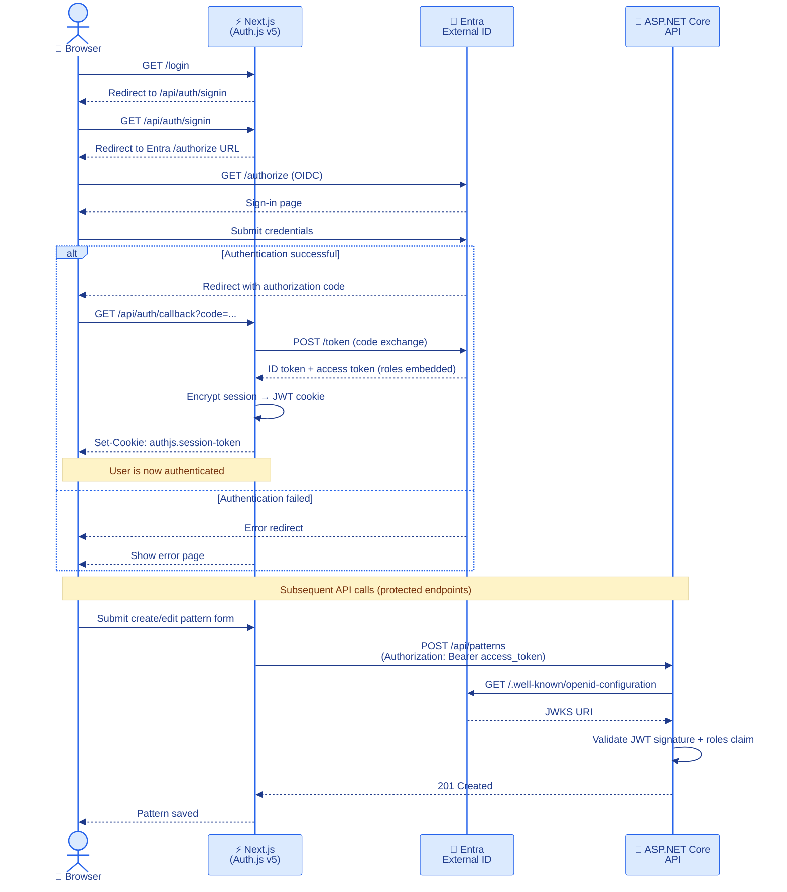
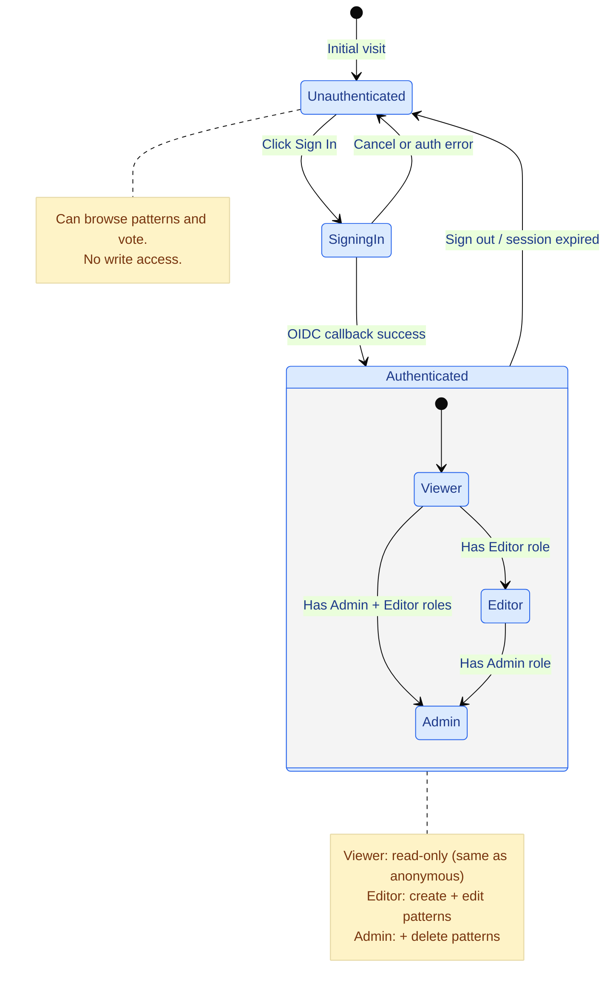

# Security Overview

**Last Updated:** 2026-03-19
**Audience:** Security Engineers, Solutions Architects, Backend Developers, Infrastructure Engineers
**Purpose:** Document the security architecture, authentication flow, protection measures against common vulnerabilities, and security headers configuration.

---

## 1. Authentication Architecture

```
Browser
  │
  ▼
Next.js (Auth.js v5 — OIDC client)
  │  - Encrypted JWT session cookie
  │  - No database session table
  │
  ▼
Azure Entra External ID (OIDC provider)
  │  - Handles sign-in, MFA, branding
  │  - Issues ID token + access token
  │  - Roles embedded in access token via App Roles
  │
  ▼
ASP.NET Core API (JwtBearer middleware)
  - Validates JWT via OIDC discovery endpoint
  - No Microsoft-specific packages
  - Standard AddJwtBearer()
```



**Provider:** Azure Entra External ID (free tier, <50,000 MAU). Note: Azure AD B2C was deprecated May 2025.

**Provider-agnostic design:** Swapping OIDC providers requires only changing environment variables. The code uses Auth.js generic `type: "oidc"` provider.

**Guard clause:** JwtBearer is only registered when `Authentication:Authority` is configured. Tests and local development work without Entra credentials.

---

## 2. Authorization Model

### Roles

Roles are embedded in the JWT access token via Azure Entra App Roles.

| Role | Permissions |
|------|------------|
| `Admin` | Full access — create, edit, delete patterns |
| `Editor` | Create and edit patterns |
| `Viewer` | Read-only (same access as anonymous users) |

### Authorization Policies

Policies are always registered (even without Entra configured), required for `[Authorize]` attributes to function in tests:

| Policy | Required Role | Applied To |
|--------|-------------|-----------|
| `RequireAdmin` | Admin | DELETE `/patterns/{id}` |
| `RequireEditor` | Editor or Admin | POST `/patterns`, PUT `/patterns/{id}` |
| `RequireViewer` | Any authenticated | GET `/auth/me` |



### Public Endpoints

All GET pattern endpoints and the vote endpoint are public (no authentication required):
- `GET /patterns`, `/patterns/featured`, `/patterns/trending`, `/patterns/{slug}`, `/patterns/{slug}/related`
- `POST /patterns/{id}/vote`
- `GET /health`, `/health/ready`

---

## 3. Input Validation

| Layer | Mechanism |
|-------|----------|
| Backend DTOs | FluentValidation (`CreatePatternDto`, `UpdatePatternDto`) |
| Backend query params | `GetPatternsQuery` with `Range` / `MaxLength` constraints |
| All text inputs | `MaxLength` constraints on all fields |
| Automatic enforcement | Model validation filter (`AddValidatorsFromAssembly` + validation filter) |

---

## 4. Protection Against Common Vulnerabilities

### XSS (Cross-Site Scripting)
- `rehype-sanitize` on all markdown content rendered on the frontend
- Secure JSON-LD structured data rendering
- Content Security Policy (CSP) headers on all responses

### CSRF (Cross-Site Request Forgery)
- `SameSite` cookie policy on Auth.js session cookies

### SQL Injection
- EF Core parameterized queries throughout — no raw SQL strings
- No dynamic query construction

### Information Disclosure
- No exception details in API responses (production)
- Swagger/OpenAPI UI disabled in production
- `ProblemDetails` format with generic error messages

### Rate Limiting
- Fixed window rate limiter on vote endpoint: 10 requests/minute per IP
- API endpoints: 50 requests/minute per IP
- General: 100 requests/minute per IP

---

## 5. CORS Configuration

Backend CORS policy (`AllowFrontend`) is environment-specific:

| Setting | Value |
|---------|-------|
| Allowed origins | Development: `http://localhost:3000` (auto-added) + any `FrontendUrl`/`FrontendUrls` config. Production: `FrontendUrl`/`FrontendUrls` config only — localhost never added. |
| Allowed methods | GET, POST, PUT, DELETE, OPTIONS |
| Allowed headers | Content-Type, Authorization, X-Requested-With |
| Credentials | Allowed |

- **Development** (`IsDevelopment() == true`): `http://localhost:3000` is automatically included. Additional origins from `FrontendUrl` / `FrontendUrls` config are also added.
- **Production** (`IsDevelopment() == false`): Only origins explicitly configured via `FrontendUrl` or `FrontendUrls` are allowed. No localhost origins.

---

## 6. Security Headers (Backend)

Applied to all ASP.NET Core API responses via inline middleware in `Program.cs`:

| Header | Value | Scope |
|--------|-------|-------|
| `X-Content-Type-Options` | `nosniff` | All environments |
| `X-Frame-Options` | `DENY` | All environments |
| `X-XSS-Protection` | `1; mode=block` | All environments |
| `Referrer-Policy` | `strict-origin-when-cross-origin` | All environments |
| `Strict-Transport-Security` | `max-age=31536000; includeSubDomains` | Production only (`!IsDevelopment()`) |

Note: No `preload` directive — HSTS preload list submission requires a stable production domain and is deferred to post-launch.

---

## 6a. Security Headers (Frontend)

Applied to all Next.js responses via `next.config.mjs`:

| Header | Value |
|--------|-------|
| `Content-Security-Policy` | Restricts scripts, styles, images, fonts; includes `ciamlogin.com` for auth |
| `Strict-Transport-Security` | `max-age=63072000; includeSubDomains; preload` |
| `X-Frame-Options` | `DENY` |
| `X-Content-Type-Options` | `nosniff` |
| `Referrer-Policy` | `origin-when-cross-origin` |
| `Permissions-Policy` | Restricts camera, microphone, geolocation |

---

## 7. Secrets Management

| Secret | Storage |
|--------|---------|
| Database connection string | Azure Key Vault |
| Entra client secret | Azure Key Vault (via Container App secret references) |
| Strapi API token | Azure Key Vault / Container App secrets |
| Revalidation webhook secret | Azure Key Vault / Container App secrets |
| GitHub CI/CD credentials | GitHub Secrets (OIDC federated identity) |

**No secrets in code or committed files.** Deployment scripts use `az keyvault secret` for all sensitive values.

---

## 8. Container Security

- All 3 Dockerfiles (`Dockerfile`, `backend/Dockerfile`, `cms/Dockerfile`) use multi-stage builds
- All `FROM` lines SHA-pinned to immutable digest (`@sha256:<64-char-hex>`) — mutable tag kept as a comment for readability; Dependabot Docker ecosystem keeps pins current
- Backend runtime uses `aspnet:8.0-alpine` — no `apt-get` or `curl` layer (~90 MB vs ~240 MB previously); healthcheck uses BusyBox `wget -qO-` (pre-installed in Alpine)
- All containers run as non-root users (`appuser`, `nextjs`, `strapi`)
- Ports <1024 require root; backend uses port 8080 inside container (mapped to 80/443 externally)
- Container images stored in Azure Container Registry with RBAC access

---

## 9. Cryptographic Security

- Deployment scripts use `System.Security.Cryptography.RandomNumberGenerator` for password generation (not `Random`)
- Auth.js `AUTH_SECRET` generated with `openssl rand -base64 32`

---

## 10. Security Operations

| Topic | Reference |
|-------|----------|
| Setting up Azure Entra External ID | [../operations/AUTH_SETUP_GUIDE.md](../operations/AUTH_SETUP_GUIDE.md) |
| Incident response procedures | [../operations/INCIDENT_RESPONSE.md](../operations/INCIDENT_RESPONSE.md) |
| Codebase security audit findings | [../reviews/CODEBASE_REVIEW_REPORT.md](../reviews/CODEBASE_REVIEW_REPORT.md) |
