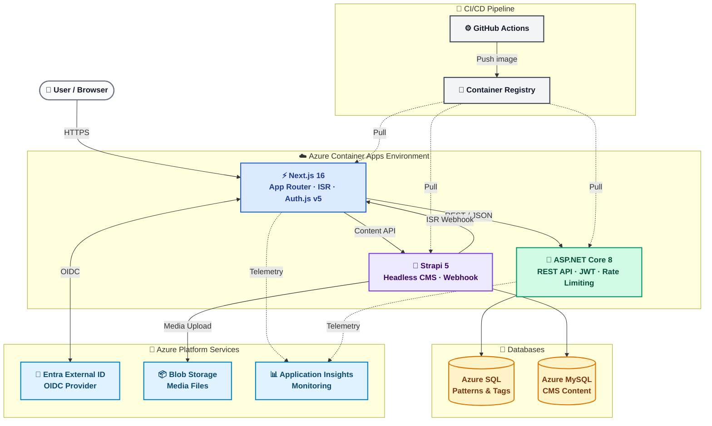

# System Overview

**Last Updated:** 2026-02-27
**Audience:** Solutions Architect, all developers, new contributors
**Purpose:** High-level overview of the AI Enterprise Patterns Library system — what it is, what it does, and how its major components interact.

---

## 1. Vision

The AI Enterprise Patterns Library is a structured, searchable, and community-driven knowledge base of AI-assisted enterprise architectural patterns.

Each "Pattern" represents a reusable implementation blueprint that may include:

- Architectural guidance
- AI prompts or workflows
- Code examples
- Tooling recommendations
- Best practices and trade-offs

The platform is designed for extensibility and maintainability following enterprise-grade development practices (DRY, SOLID, Clean Architecture).

Organizations can use this platform to:

- Consume curated AI-based implementation patterns
- Share internal best practices
- Standardize AI-assisted development approaches
- Self-host the solution via GitHub for internal use

---

## 2. Technology Stack

### Frontend

| Technology | Purpose |
|-----------|---------|
| Next.js 16 (App Router, React 19) | Server-side rendering, routing, ISR |
| TypeScript | Type safety throughout |
| Tailwind CSS | Utility-first styling |
| shadcn/ui | Component primitives |
| Auth.js v5 (NextAuth) | Authentication (OIDC provider-agnostic) |
| react-markdown + rehype-sanitize | Safe markdown rendering |
| Sonner | Toast notifications |
| Lucide | Icon library |
| next/image | Optimized image loading |

### Backend

| Technology | Purpose |
|-----------|---------|
| ASP.NET Core 8 (Web API) | RESTful API server |
| C# 12 | Implementation language |
| Entity Framework Core 8 | ORM with code-first migrations |
| FluentValidation | DTO and query validation |
| xUnit + Moq | Testing framework |

### Infrastructure & Platform

| Technology | Purpose |
|-----------|---------|
| Azure Container Apps | Primary hosting (scale-to-zero) |
| Azure SQL | Production database |
| Azure Container Registry | Docker image storage |
| Azure Application Insights | Monitoring and telemetry |
| Azure Key Vault | Secrets management |
| Azure Blob Storage | CMS media files |
| GitHub Actions | CI/CD pipelines |

### CMS

| Technology | Purpose |
|-----------|---------|
| Strapi 5 | Headless CMS for all static site content |
| MySQL (Azure Flexible Server) | Strapi production database |
| Docker Compose | Local CMS development |

### Development Environment

| Environment | Database | API |
|------------|---------|-----|
| Development | SQLite | http://localhost:5255 |
| Production | Azure SQL | Azure Container Apps URL |

---

## 3. Architecture Components

The system has three distinct application tiers and a shared infrastructure layer:

```
Browser
  │
  ▼
Next.js Frontend (Azure Container App)
  │  - Server Components for ISR/SSR
  │  - Client Components for interactive UI
  │  - Auth.js for session management
  │
  ├──► ASP.NET Core API (Azure Container App)
  │      - RESTful endpoints
  │      - JWT validation via OIDC discovery
  │      - Rate limiting, caching, validation
  │      └──► Azure SQL Database
  │
  └──► Strapi CMS (Azure Container App)
         - Static content management
         - On-demand ISR revalidation webhook
         └──► Azure MySQL Database
```



---

## 4. Deployed URLs

| Service | URL |
|---------|-----|
| Frontend (Production) | https://ca-aipatterns-web-prod.mangotree-f65a3b02.centralus.azurecontainerapps.io |
| Backend API (Production) | https://ca-aipatterns-api-prod.mangotree-f65a3b02.centralus.azurecontainerapps.io |
| Strapi CMS (Production) | https://ca-aipatterns-cms-prod.mangotree-f65a3b02.centralus.azurecontainerapps.io |
| Backend (Development) | http://localhost:5255 |
| Frontend (Development) | http://localhost:3000 |
| Strapi (Development) | http://localhost:1337 |

---

## 5. Key Architectural Decisions

The most significant architectural choices are recorded in [TECHNICAL_DECISIONS_LOG.md](../decisions/TECHNICAL_DECISIONS_LOG.md). Notable examples:

- **Authentication:** Auth.js v5 + Azure Entra External ID (OIDC, provider-agnostic) — Decision 14-17
- **CMS:** Strapi 5 headless CMS for all static site content — Decision 28
- **Deployment:** Azure Container Apps (scale-to-zero, ~$5-12/month) — Decision 22
- **Related Patterns:** Server-side API endpoint replaces client-side computation — Decision 41
- **Dark Mode:** ThemeProvider with system preference detection — Decision 40

---

## 6. Further Reading

| Topic | Document |
|-------|---------|
| Backend layer details, API reference, data model | [BACKEND_ARCHITECTURE.md](BACKEND_ARCHITECTURE.md) |
| Frontend App Router, auth flow, component structure | [FRONTEND_ARCHITECTURE.md](FRONTEND_ARCHITECTURE.md) |
| Strapi CMS content model, webhooks, gotchas | [CMS_ARCHITECTURE.md](CMS_ARCHITECTURE.md) |
| Entity model, seeding, enum mapping | [DATA_MODEL.md](DATA_MODEL.md) |
| Auth, CORS, CSP, rate limiting, security headers | [SECURITY_OVERVIEW.md](SECURITY_OVERVIEW.md) |
| Feature requirements by page | [../requirements/FUNCTIONAL_REQUIREMENTS.md](../requirements/FUNCTIONAL_REQUIREMENTS.md) |
| Phase roadmap and status | [../project/ROADMAP.md](../project/ROADMAP.md) |
| Azure deployment guide | [../../deployment/README.md](../../deployment/README.md) |
