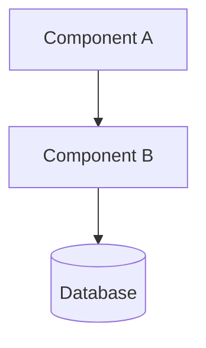
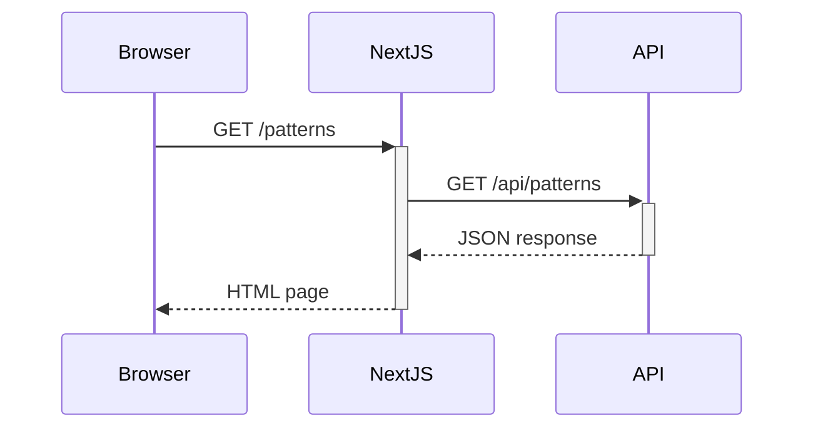

# Diagram Plan

**Last Updated:** 2026-02-27
**Audience:** All contributors
**Purpose:** Defines the planned visual diagrams for this project, their format, target location, and placeholder conventions.

---

## Overview

Diagrams are planned for a future phase. They will use **Mermaid** format (renders natively in GitHub) where possible. This file tracks what diagrams are planned, which document they belong to, and what they should depict.

---

## Placeholder Convention

In any document, mark a planned diagram with a comment:

```markdown
<!-- DIAGRAM: Architecture Overview -->
> 📐 *Diagram planned — see [DIAGRAM_PLAN.md](../diagrams/DIAGRAM_PLAN.md)*
```

---

## Planned Diagrams

### Architecture Diagrams

| Diagram | Target Document | Description | Format | Status |
|---------|----------------|-------------|--------|--------|
| System Architecture Overview | `documentation/architecture/SYSTEM_OVERVIEW.md` | High-level components: Next.js frontend, ASP.NET Core API, Azure SQL, Strapi CMS, Azure Container Apps | Mermaid flowchart TD | ✅ Complete |
| Clean Architecture Layers | `documentation/architecture/BACKEND_ARCHITECTURE.md` | Api → Core → Data layer boundaries and dependencies | Mermaid flowchart |
| Frontend Component Tree | `documentation/architecture/FRONTEND_ARCHITECTURE.md` | App Router pages, layout components, shared UI components | Mermaid flowchart |
| CMS Content Flow | `documentation/architecture/CMS_ARCHITECTURE.md` | Strapi → ISR webhook → Next.js revalidation flow | Mermaid sequence |

### Infrastructure Diagram

| Diagram | Target Document | Description | Format |
|---------|----------------|-------------|--------|
| Azure Infrastructure | `deployment/CONTAINER_APPS_GUIDE.md` | Container Apps environment, ACR, Azure SQL, MySQL (CMS), Key Vault, Application Insights, Blob Storage | Mermaid C4 Deployment |

### Sequence Diagrams

| Diagram | Target Document | Description | Format |
|---------|----------------|-------------|--------|
| Authentication Flow | `documentation/architecture/SECURITY_OVERVIEW.md` | Browser → Auth.js → Entra External ID → JWT → ASP.NET Core API | Mermaid sequence |
| Pattern Vote Flow | `documentation/architecture/BACKEND_ARCHITECTURE.md` | Client → Rate limiter → Controller → Service → DB atomic update | Mermaid sequence |
| CMS ISR Revalidation | `documentation/architecture/CMS_ARCHITECTURE.md` | Strapi publish event → webhook → Next.js revalidate → ISR cache clear | Mermaid sequence |

### Entity Relationship Diagram (ERD)

| Diagram | Target Document | Description | Format |
|---------|----------------|-------------|--------|
| Database Schema | `documentation/architecture/DATA_MODEL.md` | Pattern, Tag, PatternTag (junction), Category enum | Mermaid ER diagram |

### User Journey Diagrams

| Diagram | Target Document | Description | Format |
|---------|----------------|-------------|--------|
| Browse and Vote | `documentation/requirements/FUNCTIONAL_REQUIREMENTS.md` | Anonymous user: Home → Browse → Filter/Search → Detail → Vote | Mermaid user journey |
| Create Pattern | `documentation/requirements/FUNCTIONAL_REQUIREMENTS.md` | Authenticated Editor: Login → New Pattern → Form → Publish | Mermaid user journey |

### State Diagrams

| Diagram | Target Document | Description | Format |
|---------|----------------|-------------|--------|
| Pattern Lifecycle | `documentation/architecture/BACKEND_ARCHITECTURE.md` | Draft → Published states, edit/delete transitions | Mermaid state diagram |
| Authentication States | `documentation/architecture/SECURITY_OVERVIEW.md` | Unauthenticated → Sign-in → Authenticated → Role-gated actions | Mermaid state diagram |

### Class Diagram

| Diagram | Target Document | Description | Format |
|---------|----------------|-------------|--------|
| Backend Domain Model | `documentation/architecture/BACKEND_ARCHITECTURE.md` | Pattern, Tag, PatternService, PatternRepository, IUnitOfWork relationships | Mermaid class diagram |

---

## Mermaid Quick Reference





See [Mermaid documentation](https://mermaid.js.org) for full syntax reference.

---

## Status

| Count | Status |
|-------|--------|
| 12 | Planned |
| 0 | In Progress |
| 1 | Complete |
