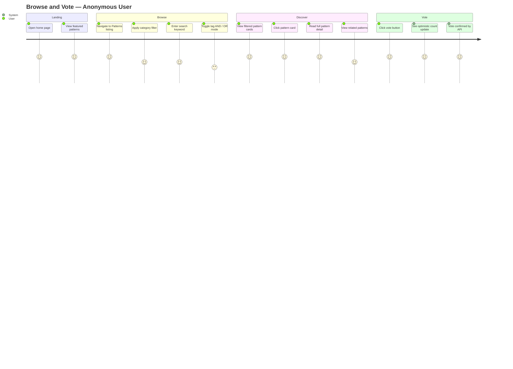
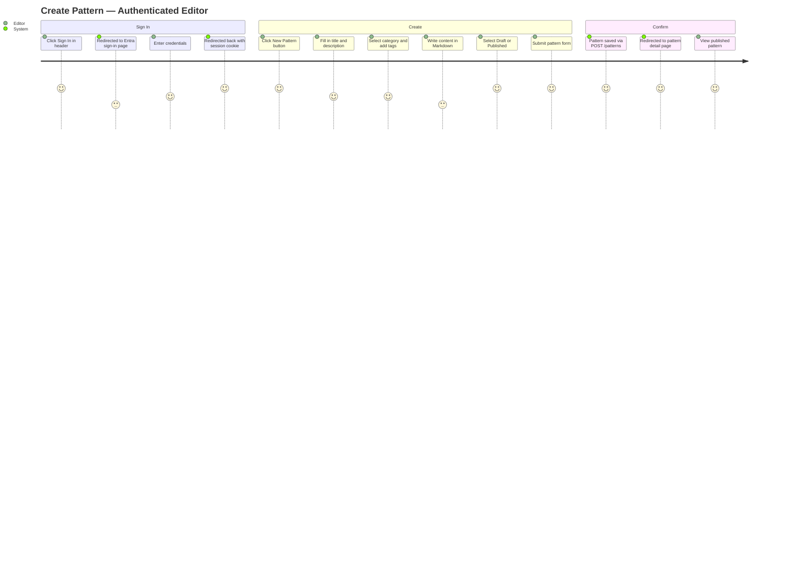

# Functional Requirements

**Last Updated:** 2026-02-27
**Audience:** Product/UX Specialists, Solutions Architects, Developers, Project Managers
**Purpose:** Define what the AI Enterprise Patterns Library must do — feature requirements by page, assumptions, out-of-scope items, and acceptance criteria.

---

## 1. Home Page

**Description:** Landing page providing platform overview and guidance.

**Requirements:**
- Display platform purpose and explanation
- Highlight featured or trending patterns
- Provide navigation to the patterns listing page
- Responsive design (mobile-first)
- Basic SEO optimization
- Animated hero section and fade-in transitions
- Dark mode support

**Current Status:** ✅ Implemented (Phases 1, 6.1)

---

## 2. Patterns Listing Page

**Description:** Displays a searchable and filterable list of available patterns.

**Requirements:**
- Display all published patterns in a card/grid layout
- Each pattern card must include:
  - Title
  - Short description
  - Tags / category
  - Author (optional)
  - Vote count
- **Search:** Full-text keyword search (title, description, tags, content)
- **Filtering:**
  - By category
  - By tags (with AND/OR mode toggle)
  - By date range
  - By popularity (votes)
- **Sorting:**
  - Most recent
  - Most voted
  - Alphabetical
- Pagination
- Skeleton loaders during loading
- Recently viewed patterns sidebar (localStorage)
- Saved searches (localStorage)
- Search autocomplete/suggestions

**Current Status:** ✅ Implemented (Phases 1, 3, 5.3, 6.1)

---

## 3. Pattern Detail Page

**Description:** Dedicated page for a single pattern, accessed by slug URL.

**Requirements:**
- Display full pattern content (Markdown rendered)
- Structured content sections:
  - Overview
  - Problem Statement
  - Proposed Solution
  - AI Prompt Examples
  - Implementation Steps
  - Trade-offs
  - Code Samples (optional)
- **Voting:** Upvote with optimistic UI and revert-on-error
- **Related patterns** section (top 3 by shared tags and category)
- Edit button (visible to Editor+ roles)
- Delete button (visible to Admin role only) with confirmation dialog
- Dark mode support

**Current Status:** ✅ Implemented (Phases 1, 3, 5.2, 6.1, 6.2)

---

## 4. Pattern Management (Editors & Admins)

**Description:** Create, edit, and delete patterns through the UI.

**Requirements:**
- **Create:** Pattern creation form with markdown editor
- **Edit:** Pattern editing with pre-filled form
- **Delete:** Delete with confirmation dialog (AlertDialog — not `window.confirm`)
- **Draft/Publish workflow:** Patterns can be saved as Draft or Published
- Tag management (add/remove tags on pattern)
- Category selection
- Role-gated access: Create/Edit → Editor+; Delete → Admin only

**Current Status:** ✅ Implemented (Phase 5.2)

---

## 5. User Authentication & Authorization

**Requirements:**
- Sign-in via Azure Entra External ID (OIDC)
- Custom branded `/login` page redirecting to Entra-hosted sign-in
- User menu in header: "Sign In" button (unauthenticated) / name + role dropdown (authenticated)
- Roles: Admin, Editor, Viewer
- JWT-based sessions (no database table)
- 401/403 error handling with user-friendly messages
- Protected pages redirect to login when unauthenticated

**Current Status:** ✅ Implemented (Phase 5.1)

---

## 6. Accessibility Requirements

**Requirements (WCAG 2.1 AA):**
- Skip-to-content link in layout
- Semantic HTML throughout
- `<label htmlFor>` matching `id` on all form inputs
- Keyboard navigation support for all interactive elements
- Screen reader compatible (`aria-label`, `aria-pressed`, `aria-current`, `aria-required`, `aria-invalid`, `aria-busy`)
- Focus-visible indicators on all interactive elements
- Live regions for dynamic content updates (vote count, loading states)
- AlertDialog replaces `window.confirm` for destructive actions

**Current Status:** ✅ Implemented (Phase 5.4)

---

## 7. CMS-Managed Content

**Requirements:**
- All static site content served from Strapi CMS (not hardcoded in components)
- On-demand ISR revalidation when content changes in CMS
- Graceful fallback to hardcoded defaults when CMS is unavailable

**Scope:**
- ✅ Home page, global layout (nav, footer) — implemented
- 🔜 About page, Docs page, Login page, Error page, 404 page — Phase 6.4
- 🔜 Pattern listing labels, Pattern detail labels, Pattern form labels — Phase 6.5

---

## 8. Assumptions

- Users are internal to an organization unless the platform is deployed publicly
- Authentication is optional — the platform operates in read-only mode for anonymous users
- Strapi CMS manages all static content within pages and components
- Voting does not require authentication in the current implementation

---

## 9. Out of Scope (Initial Version)

- Advanced AI-powered recommendation engine
- AI auto-generation of pattern content
- Multi-tenant SaaS architecture
- Complex analytics dashboard
- Email notification system
- Commenting system on patterns
- Pattern versioning / change history

These features are planned for Phase 7+ — see [../project/ROADMAP.md](../project/ROADMAP.md).

---

## 10. Acceptance Criteria

The system is considered functionally complete when:

- Users can view, search, and filter patterns
- Users can view detailed pattern pages with full content
- Authenticated editors can create, edit, and delete patterns
- Voting functionality increments correctly
- The project can be cloned and deployed from GitHub
- The system adheres to enterprise architectural best practices
- All pages pass WCAG 2.1 AA accessibility requirements
